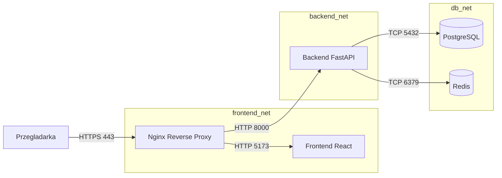

# Aplikacja do notatek (React TS + Python FastAPI)

Głównym celem tego projektu jest spełnienie wszystkich wymagań postawionych na przedmiocie, jednocześnie dbając o przejrzystość i uproszczenie struktury do minimum.

## Jak uruchomić?

W systemie MUSI znajdować się zainstalowany Docker (oraz Docker Compose).
1. Otwórz terminal w tym folderze.
2. Uruchom polecenie: `docker-compose up --build`
3. Wejdź na adres: [https://localhost](https://localhost).
   > UWAGA: Ponieważ użyto certyfikatów *self-signed*, przeglądarka wyświetli ostrzeżenie. Zaakceptuj je, aby wejść na stronę (np. *Advanced -> Proceed to localhost*).

## Gdzie w kodzie znajdują się zaimplementowane wymagania?

1. **3 niezależne moduły**
   Zrealizowano. Trzy niezależne bufory logiki biznesowej, oddzielone na 3 kontenery: frontend (React), backend (Python FastAPI), SSL Proxy/Gateway (Nginx). Patrz: `docker-compose.yml`.

2. **Docker**
   Zrealizowano. Dostarczono odpowiednie pliki `.yaml` i `Dockerfile`. Patrz: `docker-compose.yml`, `backend/Dockerfile`, `frontend/Dockerfile`, `nginx/Dockerfile`.

3. **Szyfrowanie SSL/TLS komunikacji serwera z klientem**
   Zrealizowano za pomocą *Nginx Reverse Proxy*. Wygenerowany na starcie skryptem auto-generującym certyfikat zapewnia w 100% odsługę TLS i przekierowuje ruch HTTP na szyfrowany port HTTPS 443. Patrz: `nginx/nginx.conf` oraz `nginx/generate-certs.sh`.

4. **Przechowywanie danych pomiędzy restartami serwera**
   Zrealizowano. Do przechowania tekstu użyto relacyjnej bazy PostgreSQL (wolumen `db_data`). Pliki, takie jak grafiki ikonek, zapisuja sie na wolumenie `uploaded_icons`.
   Patrz: `docker-compose.yml` (część `volumes`), kod w `backend/main.py` tworzący rekordy w DB.

5. **Spójny, użyteczny, prosty w obsłudze interfejs**
   Zrealizowano dzięki bibliotece React, budując strukturę Single Page Application (SPA), która odpytuje endpointy asynchronicnzie pod maską. Patrz: Kod zawarty w `frontend/src/App.tsx`.

6. **Przesyłanie zdjęć do ikonek notatek**
   Zrealizowano. Pasek po stronie klienta do przesyłu grafiki działa. Obsługę pliku, wygenerowanie autorskich nazw po stronie serwera i zapis na osobnym Storage Volume ujęto w kodzie Backendu. Patrz: `backend/main.py` (definicja `create_note()`, odbieranie `File()`). 

7. **Monitorowanie komunikacji**
   Zrealizowano. Postawiono na przechwytywanie dokładnych logów operacyjnych z serwera Nginx prosto do logów zapisywanych na dysku w wyznaczonym do tego folderze `logs/`. Ruch klient->proxy i proxy->backend jest odpowiednio flagowany. Patrz: plik `nginx/nginx.conf` (`access_log /var/log/nginx/access.log`).

8. **Prosta dokumentacja**
    Zrealizowano w postaci tego pliku (README.md). Ponadto, dokumentacja i wykaz endpointów API dostępna jest automatycznie (Swagger) załączona i wyeksponowana na trasie [https://localhost/api/docs](https://localhost/api/docs). Zastosowano samo-dokumentujace kod (Python z FastAPI i Pydantic).

## Schemat modulow



## Lista endpointow API

- POST /api/register
- POST /api/login
- GET /api/notes
- POST /api/notes
- PUT /api/notes/{note_id}
- DELETE /api/notes/{note_id}
- GET /api/docs (Swagger)
- WebSocket /api/ws

## Demonstracja rate limiting

Limiter ustawiony jest na 5 prob na minute dla /api/login i /api/register. Mozna to szybko sprawdzic:

```bash
for i in {1..7}; do curl -k -X POST https://localhost/api/login -H "Content-Type: application/json" -d '{"username":"test","password":"test"}'; echo; done
```

Po kilku probach serwer zwroci status 429.

## Mapowanie wymagan

**15 punktow**
- 5 modulow: frontend, backend, nginx reverse proxy, PostgreSQL, Redis.
- Wszystkie moduly w Dockerze: jeden docker-compose, sieci, ENV.
- Szyfrowanie i separacja sieci: HTTPS przez Nginx oraz trzy sieci (`frontend_net`, `backend_net`, `db_net`).
- Komunikacja WebSocket: /api/ws, klient nasluchuje na komunikaty.
- Rate limiting: limiter dla /api/login i /api/register + demonstracja w sekcji wyzej.

**10 punktow**
- 3 moduly (w tym wlasny backend) - spelnione w zestawie 5 modulow.
- Przesylanie plikow: upload ikony notatki.
- Trwalosc danych: Postgres (db_data) + wolumen na pliki.
- Bezpieczne logowanie: hashowanie bcrypt + JWT.
- Kody HTTP: 200/201/204, 401/403, 404, 429.

**5 punktow**
- Dokumentacja + schemat modulow + lista endpointow: ten plik.
- Klient i serwer: REST API + WebSocket.
- Klient webowy: przegladarka (React).
- Rozbudowany CRUD: dodawanie, edycja, usuwanie + osobny formularz logowania/rejestracji.
- Monitorowanie komunikacji: logi Nginx w katalogu logs/.
